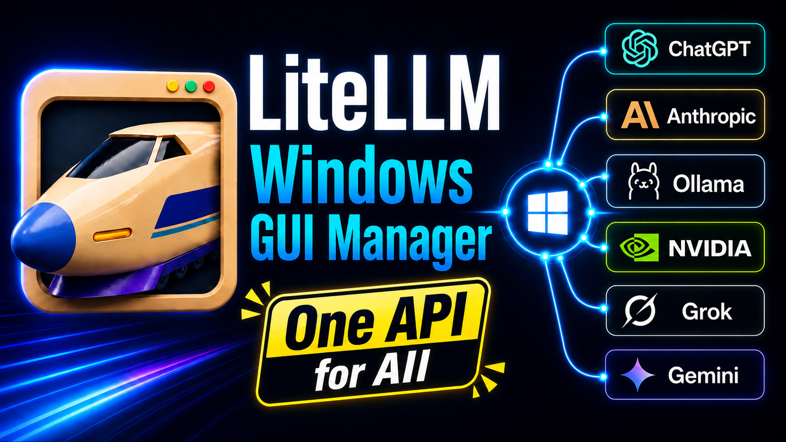
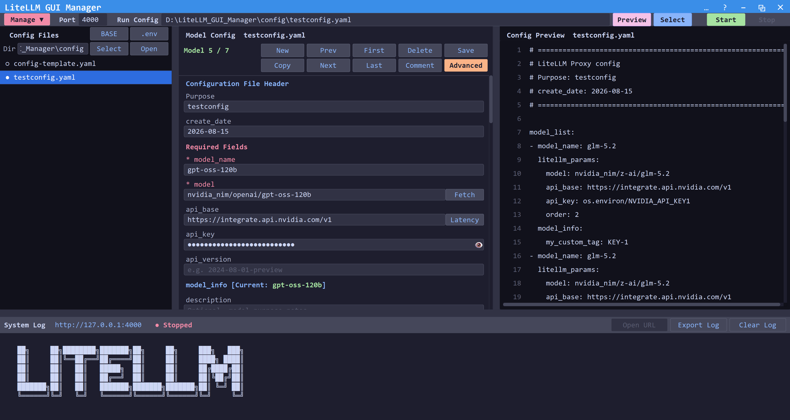
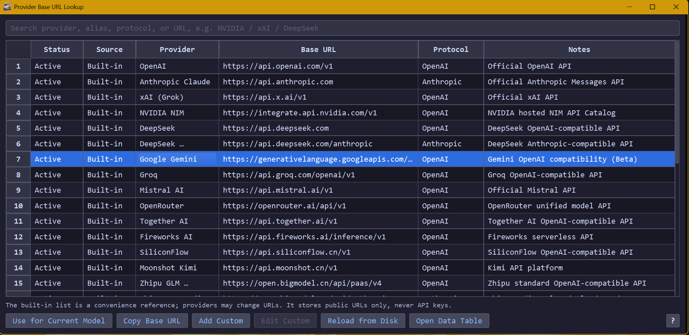
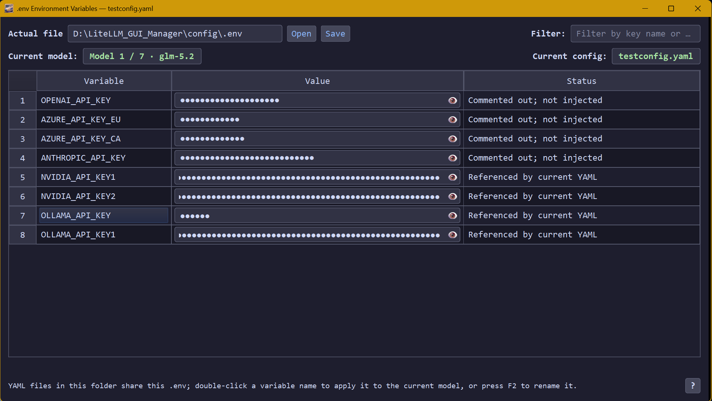
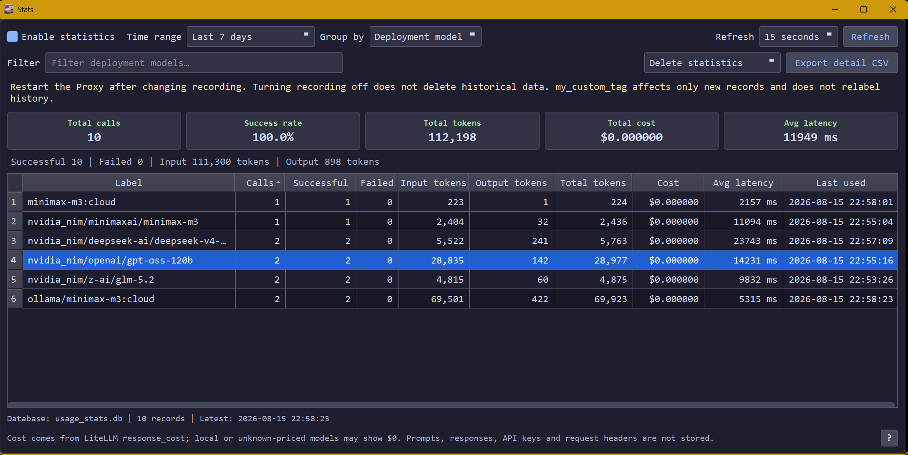
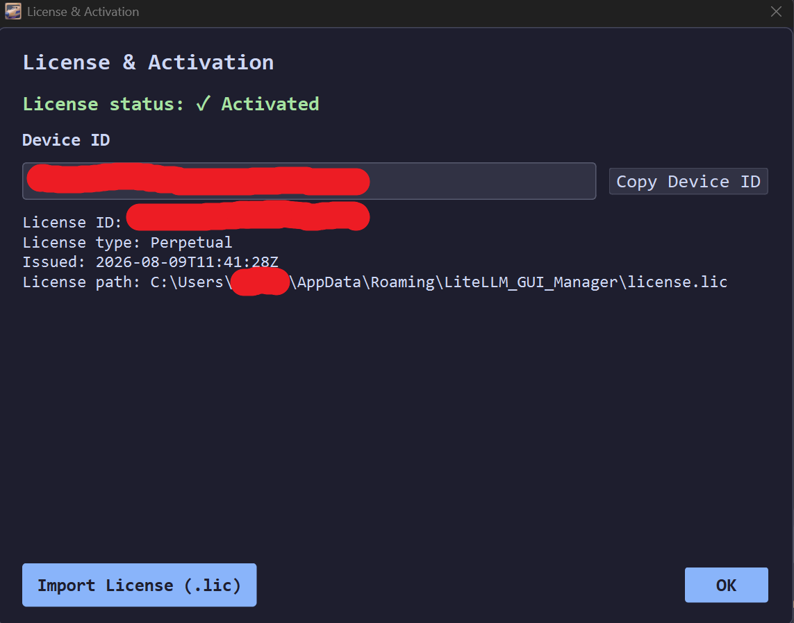

# LiteLLM GUI Manager

**LiteLLM GUI Manager is a graphical desktop management tool for LiteLLM on Windows.**

Use a graphical interface to manage YAML configurations, providers and model prefixes, API base URLs, .env environment variables, LiteLLM Proxy start/stop, and local usage statistics — without manually editing configuration files or frequently using the command line.

> [LiteLLM](https://github.com/BerriAI/litellm) is an open-source project. LiteLLM GUI Manager is an independently developed, third-party Windows desktop tool — it is not an official LiteLLM product, and it will be released as **paid commercial software**.

**Status: v1.0.0 — Coming Soon**

---

[中文](README-zh.md) | [Pricing](#pricing) | [Download](#download) | [Watch Demo](#demo-video) | [Terms](https://waynetech157.github.io/LiteLLM-GUI-Manager/terms.html) | [Privacy](https://waynetech157.github.io/LiteLLM-GUI-Manager/privacy.html) | [Refunds](https://waynetech157.github.io/LiteLLM-GUI-Manager/refund.html)

---

## Purchase

**US$29 — One-time purchase**

The current commercial license is a **Perpetual License**.

A perpetual license allows continued use of the purchased version. Future major versions or separately released products may require a separate purchase.

> Purchase checkout will be available when the public release goes live.

Refund terms: [Refund Policy](https://waynetech157.github.io/LiteLLM-GUI-Manager/refund.html)

---

## Demo Video

Watch the full LiteLLM GUI Manager demo:

**LiteLLM GUI Manager for Windows – Easy Setup, Model Management & Claude Code Demo**

▶ [Watch the full demo on YouTube](https://youtu.be/DaOdhE2iS-U)

---

## Screenshots

**Main Interface**

**Provider & Base URL Management**

**Environment Variables & API Key Management**

**Usage Statistics**

**License & Activation**

---

## Why LiteLLM GUI Manager

[LiteLLM](https://github.com/BerriAI/litellm) is a powerful proxy that unifies access to dozens of LLM providers. Configuring it on Windows, however, means hand-editing YAML files, `.env` files, provider prefixes, base URLs, and API keys — and restarting the proxy from a terminal each time something changes.

LiteLLM GUI Manager is a desktop management layer that sits alongside LiteLLM. **It does not replace LiteLLM and does not provide AI model service itself.** It launches LiteLLM Proxy through your local Python environment and gives you a structured interface for managing all the surrounding configuration.

---

## Key Features

- **Multiple YAML configuration management** — create, copy, rename, delete, and switch between LiteLLM YAML config files through a form-based editor.
- **Model configuration & model-list fetching** — add and edit `model_name`, real model IDs, `api_base`, `api_key`, advanced parameters, and `model_info`; fetch available models from a configured API base.
- **BASE URL / custom provider management** — store and manage API base URLs, provider names, and endpoint aliases in one place.
- **`.env` environment-variable management** — table-based editor with show/hide for secret values, and automatic flagging of variables referenced in YAML but missing from `.env`.
- **API Key / master key masked editing** — sensitive fields stay hidden by default, with copy/cut paths restricted to reduce accidental exposure.
- **LiteLLM Proxy start / stop with live logs** — select a config and port, then start or stop the proxy with real-time log output in the app.
- **LiteLLM component install / version check / uninstall** — install, update, or remove the LiteLLM package without touching the command line.
- **Provider catalogue / prefix updates** — keep provider prefixes and the base provider catalogue current for model-ID assistance.
- **Usage statistics, filtering, CSV export & deletion** — local per-request statistics (provider, model, tokens, estimated cost, latency, success state) with filtering, CSV export, and time-range deletion.
- **Settings backup and restore** — package GUI settings, BASE/provider data, and YAML configs into a single ZIP archive.
- **Chinese / English interface** — switch languages at any time, including from the activation window.
- **Machine-bound commercial license activation** — a developer-issued `.lic` file tied to your device unlocks the application.

Works with LiteLLM-supported providers, including services such as OpenAI, Anthropic, NVIDIA, Ollama, Gemini, Grok, OpenRouter, and others supported by LiteLLM. LiteLLM GUI Manager does not claim official support, partnership, or endorsement from any of these providers — provider connectivity depends on LiteLLM itself and on each provider's own API.

---

## Quick Start

1. Download and extract LiteLLM GUI Manager.
2. Launch `LiteLLM_GUI_Manager.exe`.
3. First-time users can switch between English and Chinese directly in the activation window.
4. Activate the software using a machine-bound `.lic` license.
5. If LiteLLM is not installed, use **Manage → Install Components**.
6. Select or create a LiteLLM YAML configuration.
7. Configure models, BASE URLs, and `.env` / API credentials as needed.
8. Select the startup configuration and port.
9. Start the LiteLLM Proxy.
10. Connect Claude Code or another compatible API client to the local LiteLLM Proxy and make a test request.

---

## License Activation

LiteLLM GUI Manager uses a **machine-bound license** issued per device.

**Activation steps:**

1. Launch the application — the activation window opens automatically if no valid license is found.
2. Copy the **Device ID** shown in the activation window.
3. Complete your purchase at the [purchase page](#purchase).
4. You will receive a `.lic` file bound to your Device ID.
5. Click **Import License** and select the `.lic` file.
6. The application unlocks and you can proceed to the main window.

**Transferring to a new machine:**  
The `.lic` file is bound to one device. Moving to a new machine requires reactivation with that machine's own Device ID — a settings backup does not transfer or substitute for a license. Contact support for the machine-transfer policy.

---

## Backup & Restore

Use **Manage → Backup & Restore** to move your setup to another PC or keep a safe copy.

| Included by default | Optional (user must opt in) | Never included |
|---|---|---|
| GUI settings | `.env` — may contain API keys; the backup ZIP itself is not encrypted | `license.lic` |
| BASE / Provider data | `usage_stats.db` (usage statistics history) | |
| YAML config files | | |

Restoring a backup on a new PC brings back your configuration, but that PC still needs its own valid, freshly activated license using its own Device ID.

Machine-specific configuration paths are not migrated from the old computer; restored configurations are placed into the destination computer's current configuration directory.

---

## Privacy & Local Data

LiteLLM GUI Manager does not provide its own cloud-sync service for your configurations, API keys, license data, or usage database. Settings, YAML configs, and statistics are written to local files on your machine, and there is no telemetry or crash reporting sent to the developer.

This does **not** mean the application never makes network requests. Depending on what you do in the GUI, normal network access occurs for:

- LiteLLM / model provider API requests (proxied through LiteLLM Proxy)
- Fetching provider model lists
- Provider catalogue updates
- Checking the latest LiteLLM version on GitHub

API keys are stored wherever you configure them — typically your local `.env` file or directly in a YAML config — and are used only to authenticate the requests you initiate, following LiteLLM's and the provider's normal authentication flow. Masked fields in the GUI reduce accidental exposure on screen and via copy/paste, but this is a convenience measure, not a replacement for OS-level security or your own credential hygiene.

---

## Data Locations

In the packaged Windows build, the typical user data directory is:

`%APPDATA%\LiteLLM_GUI_Manager\`

This may include:

| File | Purpose |
|---|---|
| `settings.json` | GUI settings |
| `license.lic` | machine-bound license |
| `usage_stats.db` | local usage statistics |
| `provider_endpoints_custom.json` | custom BASE entries |
| `provider_endpoints.json` | optional complete BASE catalogue override |
| `crash.log` | generated only when diagnostic/error information needs to be written |

`provider_prefixes.json` may exist either in `%APPDATA%\LiteLLM_GUI_Manager\` or beside the application executable, depending on the writable location and provider catalogue update history.

**YAML configuration files** default to the `config\` directory next to the application. The configuration directory can be changed in the GUI.

**`.env`** follows whichever configuration directory is currently selected — it is not fixed under `%APPDATA%`.

---

## System Requirements

| Requirement | Details |
|---|---|
| OS | Windows 10 / 11, 64-bit |
| GUI runtime | No additional installation needed for the packaged GUI itself |
| LiteLLM Proxy | Requires a local Python environment (3.10–3.13 recommended); install via **Manage → Install Components** |
| Network | Required for API calls, model discovery, and version checks; not required for the GUI to open after activation |

---

## Download

> **v1.0.0 — Coming Soon.**  
> The release ZIP and release notes will be published here when available. Starting with the official v1.0.0 release, a SHA-256 checksum will be published alongside each release asset so you can verify your download.

<!-- Release assets will be listed here -->

Download only from this official repository page.

---

## Purchase

> **Purchase information will be available before the public release.**

Pricing, license type, device count, machine-transfer policy, and refund terms will be listed on the purchase page when available.

---

## FAQ

**What is LiteLLM GUI Manager?**  
A Windows desktop application that provides a graphical interface for configuring and operating LiteLLM Proxy — YAML configs, providers, `.env` variables, proxy start/stop, and local usage statistics.

**Is this an official LiteLLM product?**  
No. LiteLLM GUI Manager is an independent third-party application and is not affiliated with, endorsed by, or sponsored by the LiteLLM / BerriAI project.

**Does LiteLLM GUI Manager include LiteLLM itself?**  
No. LiteLLM GUI Manager does not bundle LiteLLM's source code. It installs and manages the official `litellm` Python package on your machine via **Manage → Install Components**, and launches it through your local Python environment.

**Where are my configurations, API keys, and statistics stored?**  
Locally on your machine. See [Data Locations](#data-locations) for exact paths. There is no cloud storage or sync provided by the application.

**Can I move my settings to another computer?**  
Yes, using **Backup & Restore**. GUI settings, BASE/provider data, and YAML configs are included by default. See [Backup & Restore](#backup--restore) for what's optional and what's excluded.

**Does a backup contain my API keys or license?**  
`.env` (which may contain API keys) is only included if you explicitly opt in when creating the backup — the backup ZIP is not encrypted, so handle it carefully. The `license.lic` file is never included in a settings backup.

**Can I use a LiteLLM version newer than the GUI's currently validated version?**  
Yes, at your own discretion. The GUI distinguishes between the "currently validated version" it has been tested against and the latest release available on GitHub. It will not automatically install, downgrade, or force-switch your LiteLLM version just because a newer, unvalidated release exists — version changes are always a deliberate action you take through **Manage → Install Components**.

**Can I use custom or OpenAI-compatible providers?**  
Yes. You can add custom base URLs and provider entries through the BASE / Provider manager, in addition to the built-in provider catalogue.

---

## Support

For activation issues, bug reports, or general questions:

- Support contact: `waynetech157@outlook.com`
- Please include your Windows version, a description of the issue, and relevant log content if applicable.

---

## Disclaimer

LiteLLM GUI Manager is an independent third-party desktop application developed and maintained by an independent developer. It is **not** an official product of LiteLLM / BerriAI, OpenAI, Anthropic, Google, NVIDIA, or any other AI model or API provider. No affiliation, sponsorship, or endorsement by those parties is implied.

LiteLLM, model APIs, network services, model output quality, pricing, quotas, availability, and provider terms of service are controlled entirely by their respective third parties. Users are responsible for complying with all applicable provider terms and laws, protecting their own credentials, and paying any API charges incurred.

The proprietary software license for LiteLLM GUI Manager will be provided as `EULA-en.txt` / `EULA-zh.txt` with the official release. Third-party open-source component notices will be provided as `THIRD_PARTY_LICENSES.txt`. Both are still in draft form and are not yet published in this repository.

---

## Links

- LiteLLM documentation: [https://docs.litellm.ai/](https://docs.litellm.ai/)
- LiteLLM source: [https://github.com/BerriAI/litellm](https://github.com/BerriAI/litellm)
- Demo video: [LiteLLM GUI Manager for Windows – Easy Setup, Model Management & Claude Code Demo](https://youtu.be/DaOdhE2iS-U)
- Purchase: Coming Soon
- Support: `waynetech157@outlook.com`

---

*Copyright © 2026. All rights reserved.*  
*LiteLLM GUI Manager is proprietary commercial software.*
